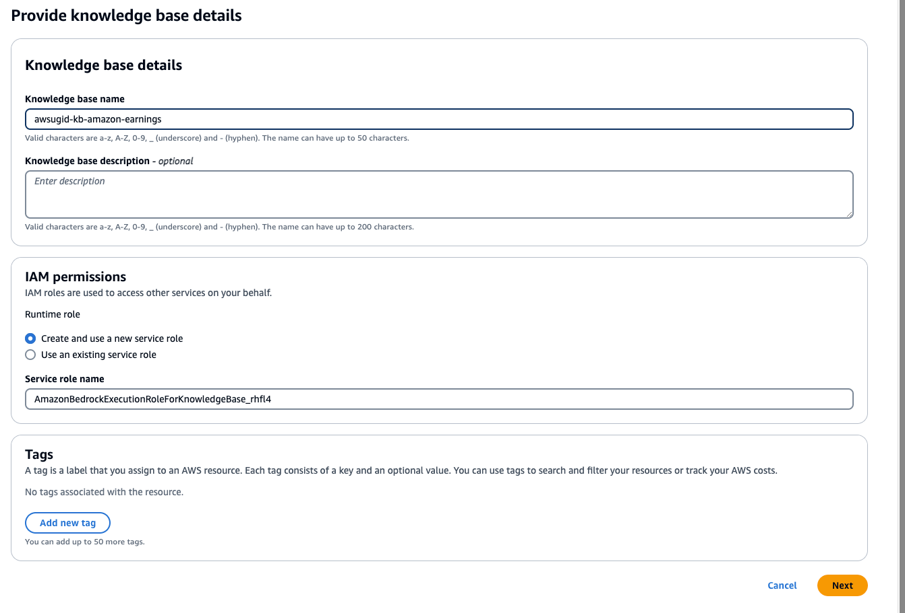
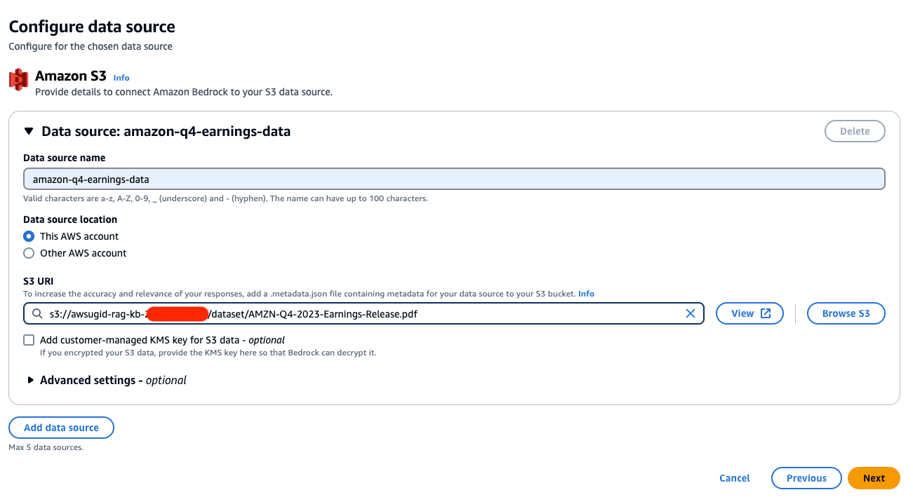
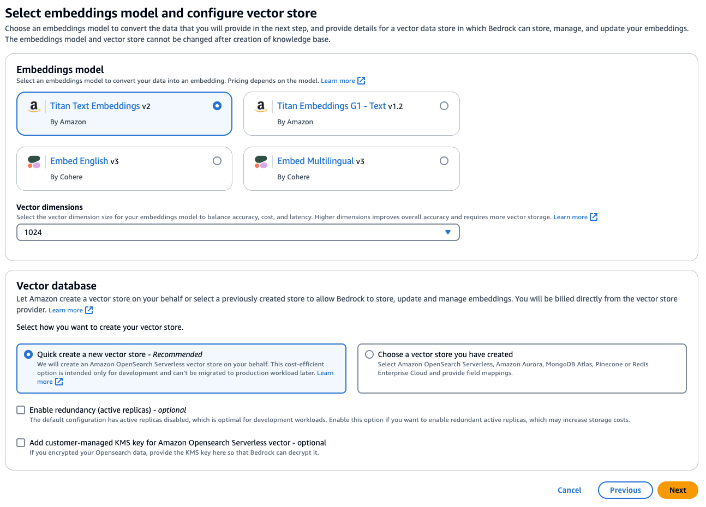
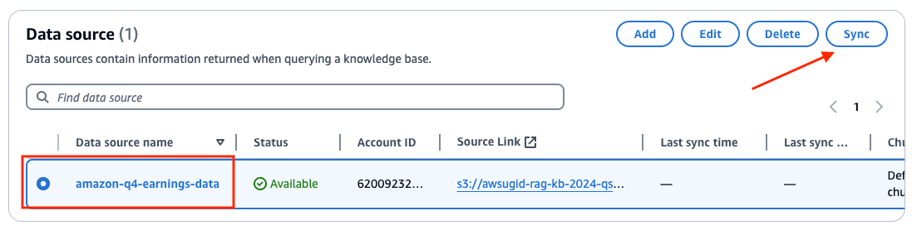
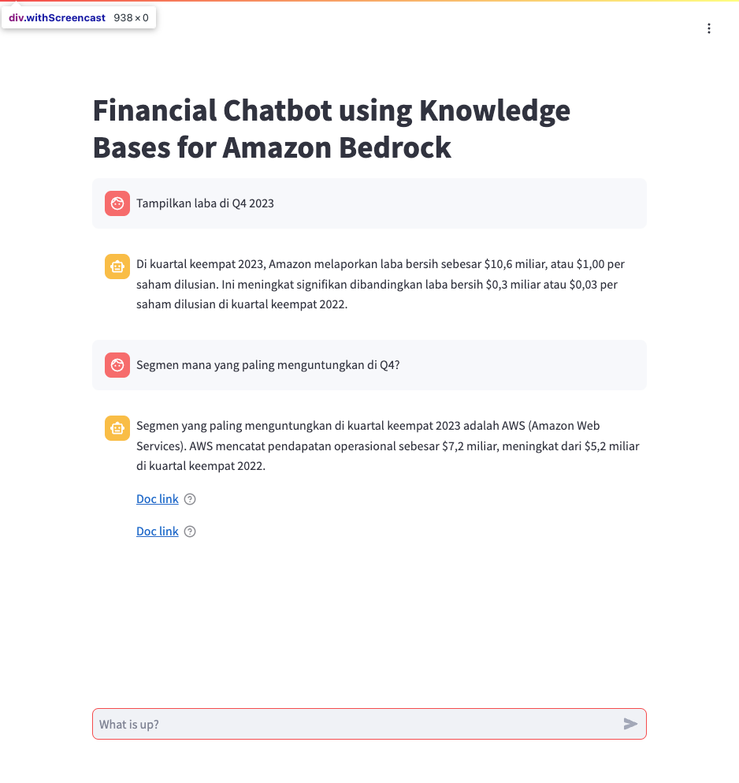

# Overview

Repositori ini diturunkan dari [aws-samples/contextual-chatbot-using-knowledgebase](https://github.com/aws-samples/amazon-bedrock-samples/tree/main/rag-solutions/contextual-chatbot-using-knowledgebase). Untuk dokumentasi detil silahkan merujuk ke GitHub repo tersebut.

Solusi pada repo ini berfokus pada bagaimana menggunakan Amazon Bedrock Knowledge Bases untuk percapakan Bahasa Indonesia. Gambaran umum implementasi RAG yang akan digunakan seperti berikut:


Solusi ini menggunakan [Streamlit](http://streamlit/) untuk membangun aplikasi chatbot dan menggunakan beberapa layanan AWS berikut:

* [Amazon Simple Storage Service)](https://aws.amazon.com/s3/) (Amazon S3) as source
* Knowledge Bases for Amazon Bedrock untuk data ingestion
* [Amazon OpenSearch Serverless](https://aws.amazon.com/opensearch-service/features/serverless/) vector store untuk menyimpman embedding text
* [AWS Lambda](https://aws.amazon.com/lambda/) sebagai API yang akan memanggil Knowledge Bases API
* Streamlit akan memanggil Lambda function untuk memproses chat dari user dan mendapatkan jawaban dari Knowledge Bases
* Embedding models yang digunakan pada Knowledge Bases adalah [Amazon Titan Text Embeddings v2](https://aws.amazon.com/bedrock/titan/).
* Untuk memproses prompt dari user dan konteks dari embedding models digunakan model [Claude 3 Sonnet](https://aws.amazon.com/bedrock/claude/) dari Anthropic.

## Prasyarat

Kamu perlu mengaktifkan model-model yang akan digunakan di Amazon Bedrock melalui halaman [Model access](https://docs.aws.amazon.com/bedrock/latest/userguide/model-access.html) sebelum memulai. Model-model berikut perlu diaktifkan:

- Titan Text Embeddings v2
- Claude 3 Sonnet

Model-model tersebut hanya tersedia di region tertentu. Untuk demo ini saya menggunakan region `us-east-1`.

## Clone repository

Clone repository ini ke mesin Kamu.

```sh
git clone git@github.com:awsugid/contextual-chatbot-using-knowledgebase.git
```

```sh
cd contextual-chatbot-using-knowledgebase
```

## Sumber dataset

Sumber data yang digunakan untuk tes adalah sebuah PDF laporan keuangan dari Amazon pada Q4 2023. File PDF ada di direktori `dataset/`

- [Amazon Q4 earnings](dataset/AMZN-Q4-2023-Earnings-Release.pdf)

Setelah itu buat sebuah Amazon S3 bucket dan upload file PDF tersebut ke bucket. Kamu bisa membuat S3 bucket dan mengupload PDF tersebut lewat web Amazon Management Console atau via AWS CLI.

Sebagai contoh bucket yang saya gunakan adalah `awsugid-rag-kb-yourname` di region `us-east-1`.

```sh
aws s3 mb s3://awsugid-rag-kb-yourname --region us-east-1
```

```sh
aws s3 cp ./dataset \
s3://awsugid-rag-kb-yourname/dataset \
--recursive --region us-east-1
```

## Membuat Knowledge base

Buat knowledge base berdasarkan laporan keuangan Amazon pada Q4 2023 yang telah diupload ke S3 bucket pada langkah sebelumnya.

1. Buka console Amazon Bedrock, pada menu navigasi bagian **Builder tools**, pilih **Knowledge bases**
2. Pilih **Create knowledge base**
3. Masukkan nama Knowledge base, contoh: `awsugid-kb-amazon-earnings`
4. Pada IAM Permissions pilih **Create and use a new service role**
5. Kemudian pilih **Next**

   

6. Pada **Data source name** isikan `amazon-q4-earnings-data`
7. Pada **S3 URI** pilih file PDF Amazon yang telah diupload ke S3 bucket sebelumnya.
8. Pilih **Next**

    

9. Pada **Embedding models** pilih **Titan Text Embeddings v2**
10. Pada **Vector dimensions** pilih `1024`
11. Pada **Vector database** pilih **Quick create a new vector store - _Recommended_**. Ini akan membuat sebuah collection baru di Amazon OpenSearch Serverless.
12. Pilih **Next** kemudian pilih **Create knowledge base**

    

Proses pembuatan Knowledge base akan memerlukan waktu beberapa saat.

## Sync data source

Setelah proses pembuatan Knowledge base selesai. Maka perlu ada langkah Sync untuk menghubungkan Knowledge base dengan vector database yang ada di Amazon OpenSearch.

1. Pastikan berada di halaman Knowledge base `awsugid-kb-amazon-earnings`
2. Pada bagian **Data source** pilih `amazon-q4-earnings-data`
3. Pilih tombol **Sync**
4. Setelah selesai maka **Status** dari data source akan berubah dari `Available` menjadi `Ready`

   

## Mengupload Lambda layer ke S3 bucket

Buat lambda layer yang berisi library boto3 menggunakan perintah berikut. Masuk ke direktori `lambda/layer/`. Di sini saya menggunakan Python 3.9.

```sh
cd lambda/layer
```

Buat environment baru dengan menggunakan Python venv.

```sh
python3 -m venv create-boto3-layer
```

Aktifkan environment baru tersebut.

```sh
source create-boto3-layer/bin/activate
```

Install library boto3 dengan pip.

```sh
pip install -r requirements.txt
```

Zip file-file library boto3.

```sh
mkdir -p python
rm -rf python/* 2>/dev/null
rm boto3-layer.zip 2>/dev/null
cp -r create-boto3-layer/lib python/
zip -r boto3-layer.zip python
```

Lambda layer ini `lambda/layer/boto3-layer.zip` berisi library boto3 versi `1.34.130` yang sudah memiliki update ke keluarga model Anthropic Claude 3.

Upload layer ini ke S3 bucket yang telah dibuat karena kedepan fungsi Lambda akan menggunakan Lambda layer ini.

```sh
aws s3 cp \
 ./boto3-layer.zip s3://awsugid-rag-kb-yourname/lambda/layer/boto3-layer.zip \
 --region us-east-1
```

## Membuat fungsi AWS Lambda

Fungsi Lambda ini akan di-deploy menggunakan AWS CloudFormation yang tersedia di direktori `cfn/`. Template dari CloudFormation tersebut di-build terlebih dahulu sebelum dijalankan. Build ini akan mengganti teks `{{LAMBDA_FUNCTION}}` di template contoh dengan isi dari file `lambda/bedrock-kb-retrieve-generate.py`.

Pastikan berada di root direktori dari project.

```sh
bash cfn/build-template.sh
```

Output:

```
Template file cfn/deploy-lambda-function.yaml.template has been built to cfn/deploy-lambda-function.yaml
```

CloudFormation template pada `cfn/deploy-lambda-function.yaml` memerlukan tiga parameter yaitu:

1. `KnowledgeBaseID` - Nama Knowledge base ID dari yang dibuat sebelumnya.
2. `LambdaLayerS3BucketName` - Nama Amazon S3 bucket yang menyimpan Lambda layer
3. `RandomId` - Random Id untuk agar nama resource menjadi unik

Di sini saya akan menggunakan AWS CLI untuk membuat sebuah CloudFormation stack.

```sh
export MY_RANDOM_ID=abc123
export MY_KB_ID=YOUR_KNOWLEDGE_BASE_ID
export MY_LAMBDA_LAYER_BUCKET=awsugid-rag-kb-yourname
```

```sh
aws cloudformation create-stack \
 --stack-name awsugid-kb-demo-$MY_RANDOM_ID \
 --template-body file://cfn/deploy-lambda-function.yaml \
 --capabilities CAPABILITY_IAM \
 --region us-east-1 \
 --parameters ParameterKey=KnowledgeBaseID,ParameterValue=$MY_KB_ID ParameterKey=LambdaLayerS3BucketName,ParameterValue=$MY_LAMBDA_LAYER_BUCKET ParameterKey=RandomId,ParameterValue=$MY_RANDOM_ID
```

## Menjalankan Chatbot

Untuk membuat aplikasi chatbot, saya memanfaatkan library Streamlit. Aplikasi chatbot ada pada direktori `streamlit/`. Sebelum menjalankan ada beberapa library yang harus diinstall.

```sh
pip install boto3 streamlit
```

Masuk pada direktori `streamlit/`.

```sh
cd streamlit
```

Dan jalankan perintah berikut untuk memulai aplikasi chatbot di port 8080.

```sh
python3 -m streamlit run chatbot.py --server.port 8080
```

Buka browser kamu dan arahkan pada alamat `http://localhost:8080/` diasumsikan hostname kamu adalah localhost.



Berikut daftar pertanyaan yang dapat dicoba pada chatbot.

Pertanyaan | Jawaban
-----------|--------
Tampilkan laba di Q4 2023 | Di kuartal keempat 2023, Amazon melaporkan laba bersih sebesar $10,6 miliar, atau $1,00 per saham dilusian. Ini meningkat signifikan dibandingkan laba bersih $0,3 miliar atau $0,03 per saham dilusian di kuartal keempat 2022.
Segmen mana yang paling menguntungkan di Q4? | Segmen yang paling menguntungkan di kuartal keempat 2023 adalah AWS (Amazon Web Services). AWS mencatat pendapatan operasional sebesar $7,2 miliar, meningkat dari $5,2 miliar di kuartal keempat 2022.
Urutkan laba bersih per segmen dari terbesar ke terkecil. Format: Segmen -> Jumlah laba bersih atau rugi bersih Contoh: Segmen X -> Laba $1,2 milyar | Berdasarkan hasil pencarian, urutan laba bersih per segmen dari terbesar ke terkecil adalah: <br><br>1. AWS -> Laba $7,167 juta<br>2. North America -> Laba $6,461 juta<br>3. International -> Rugi $419 juta
Apakah ada peluncuran AWS region baru di Q4? | Ya, AWS meluncurkan AWS Canada West (Calgary) Region di kuartal keempat 2023, yang menjadi Region infrastruktur kedua di Kanada. AWS adalah penyedia layanan cloud utama pertama yang memiliki Region infrastruktur di Kanada Barat.
Berapa jarak bumi ke matahari? | Maaf, saya tidak menemukan informasi tentang jarak bumi ke matahari dalam hasil pencarian yang diberikan. Hasil pencarian tersebut berisi informasi tentang laporan keuangan dan berita terbaru dari Amazon.

## Prompt engineering

Agar model membalas dengan Bahasa Indonesia dan tidak menjawab pertanyaan diluar konteks dari dokumen maka prompt yang ada digunakan adalah:

```
You are a question answering agent. I will provide you with a set of search results inside the <search></search> tags. The user will provide you with a question inside <question></question> tags. Your job is to answer the user's question using only information from the search results ONLY. 

If the search results do not contain information that can answer the question, reply with "Sorry, I don't know.". IMPORTANT! Do not try to become smart by providing answer outside the <search></search> result. You will be punished when giving answer outside the <search></search> result.

Always reply in Bahasa Indonesia whenever possible.

<search>$search_results$</search>

<question>$output_format_instructions$</question>
```

Prompt ini ada pada fungsi Lambda di file `lambda/bedrock-kb-retrieve-generate.py`. Prompt ini digunakan ketika memanggil Amazon Bedrock Bnowledge Base.

## Clean up

Untuk menghindari adanya biaya dari resource yang telah dibuat. Setelah selesai melakukan eksprimen jangan lupa untuk menghapus resource yang dibuat.

- Amazon Bedrock Knowledge Base: Hapus Knowledge Base yang telah dibuat.
- Amazon Open Search collection: Hapus collection yang menyimpan vector database untuk embedding
- Amazon S3 bucket: Hapus S3 bucket yang telah dibuat dan juga isinya
- AWS Lambda: Hapus AWS Lambda yang dibuat melalui CloudFormation dengan menghapus CloudFormation stack terkait

## Lisensi

Proyek ini dilisensikan dibawah MIT-0 License. Lihat file [LICENSE](LICENSE) file.
