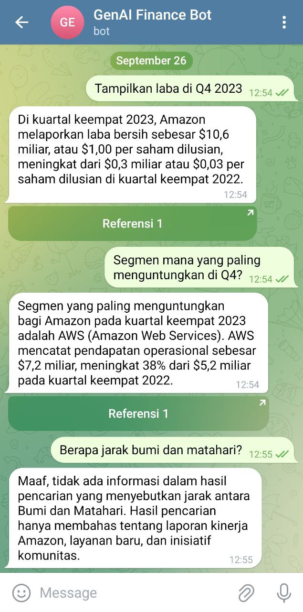

# Overview

Repositori ini diturunkan dari [aws-samples/contextual-chatbot-using-knowledgebase](https://github.com/aws-samples/amazon-bedrock-samples/tree/main/rag-solutions/contextual-chatbot-using-knowledgebase). Untuk dokumentasi detil silahkan merujuk ke GitHub repo tersebut.

Solusi pada repo ini berfokus pada bagaimana menggunakan Amazon Bedrock Knowledge Bases untuk percapakan Bahasa Indonesia. Gambaran umum implementasi RAG yang akan digunakan seperti berikut:


Solusi ini menggunakan [Streamlit](http://streamlit/) untuk membangun aplikasi chatbot dan menggunakan beberapa layanan AWS berikut:

* [Amazon Simple Storage Service)](https://aws.amazon.com/s3/) (Amazon S3) as source
* Knowledge Bases for Amazon Bedrock untuk data ingestion
* [Amazon OpenSearch Serverless](https://aws.amazon.com/opensearch-service/features/serverless/) vector store untuk menyimpman embedding text
* [AWS Lambda](https://aws.amazon.com/lambda/) sebagai API yang akan memanggil Knowledge Bases API
* Streamlit akan memanggil Lambda function untuk memproses chat dari user dan mendapatkan jawaban dari Knowledge Bases
* Embedding models yang digunakan pada Knowledge Bases adalah [Amazon Titan Text Embeddings v2](https://aws.amazon.com/bedrock/titan/).
* Untuk memproses prompt dari user dan konteks dari embedding models digunakan model [Claude 3 Sonnet](https://aws.amazon.com/bedrock/claude/) dari Anthropic.

## Prasyarat

Kamu perlu mengaktifkan model-model yang akan digunakan di Amazon Bedrock melalui halaman [Model access](https://docs.aws.amazon.com/bedrock/latest/userguide/model-access.html) sebelum memulai. Model-model berikut perlu diaktifkan:

- Titan Text Embeddings v2
- Claude 3 Sonnet

Model-model tersebut hanya tersedia di region tertentu. Untuk demo ini saya menggunakan region `us-east-1`.

## Clone repository

Clone repository ini ke mesin Kamu.

```sh
git clone git@github.com:awsugid/contextual-chatbot-using-knowledgebase.git
```

```sh
cd contextual-chatbot-using-knowledgebase
```

## Sumber dataset

Sumber data yang digunakan untuk tes adalah sebuah PDF laporan keuangan dari Amazon pada Q4 2023. File PDF ada di direktori `dataset/`

- [Amazon Q4 earnings](dataset/AMZN-Q4-2023-Earnings-Release.pdf)

Setelah itu buat sebuah Amazon S3 bucket dan upload file PDF tersebut ke bucket. Kamu bisa membuat S3 bucket dan mengupload PDF tersebut lewat web Amazon Management Console atau via AWS CLI.

Sebagai contoh bucket yang saya gunakan adalah `awsugid-rag-kb-yourname` di region `us-east-1`.

```sh
aws s3 mb s3://awsugid-rag-kb-yourname --region us-east-1
```

```sh
aws s3 cp ./dataset \
s3://awsugid-rag-kb-yourname/dataset \
--recursive --region us-east-1
```

## Membuat Knowledge base

Buat knowledge base berdasarkan laporan keuangan Amazon pada Q4 2023 yang telah diupload ke S3 bucket pada langkah sebelumnya.

1. Buka console Amazon Bedrock, pada menu navigasi bagian **Builder tools**, pilih **Knowledge bases**
2. Pilih **Create knowledge base**
3. Masukkan nama Knowledge base, contoh: `awsugid-kb-amazon-earnings`
4. Pada IAM Permissions pilih **Create and use a new service role**
5. Kemudian pilih **Next**

   

6. Pada **Data source name** isikan `amazon-q4-earnings-data`
7. Pada **S3 URI** pilih file PDF Amazon yang telah diupload ke S3 bucket sebelumnya.
8. Pilih **Next**

    

9. Pada **Embedding models** pilih **Titan Text Embeddings v2**
10. Pada **Vector dimensions** pilih `1024`
11. Pada **Vector database** pilih **Quick create a new vector store - _Recommended_**. Ini akan membuat sebuah collection baru di Amazon OpenSearch Serverless.
12. Pilih **Next** kemudian pilih **Create knowledge base**

    

Proses pembuatan Knowledge base akan memerlukan waktu beberapa saat.

## Sync data source

Setelah proses pembuatan Knowledge base selesai. Maka perlu ada langkah Sync untuk menghubungkan Knowledge base dengan vector database yang ada di Amazon OpenSearch.

1. Pastikan berada di halaman Knowledge base `awsugid-kb-amazon-earnings`
2. Pada bagian **Data source** pilih `amazon-q4-earnings-data`
3. Pilih tombol **Sync**
4. Setelah selesai maka **Status** dari data source akan berubah dari `Available` menjadi `Ready`

   

## Menjalankan Chatbot di Telegram

Saya menggunakan AWS Lambda untuk menempatkan business logic untuk menangani request dari Telegram. Fungsi ini nantinya akan memanggil Knowledge Bases for Amazon Bedrock yang sudah dibuat sebelumnya.

### Menginstall Serverless Framework

Untuk melakukan deployment fungsi Lambda yang akan dibuat saya menggunakan Serverless Framework. Install dan buat akun di [Serverless Framework](https://serverless.com).

```sh
npm install -g serverless
```

### Deploy AWS Lambda

Sebelum melakukan deploy kamu harus menset beberapa environment variable yang dibutuhkan oleh fungsi Lambda ini.

Env | Keterangan
----|-----------
APP_WEBHOOK_TOKEN | Token yang kamu tentukan untuk mengamankan Webhook URL. Ini digunakan oleh Telegram Webhook ketika melakukan request ke API Lambda.
APP_KB_ID | Knowledge Base Id yang telah dibuat sebelumnya
APP_MODEL_ID | Foundation Model Id, default ke Claude 3 Sonnet. Gunakan AWS CLI `aws bedrock list-foundation-models` untuk melihat semua foundation model yang tersedia

```sh
export APP_WEBHOOK_TOKEN=YOUR_WEBHOOK_TOKEN
export APP_KB_ID=YOUR_KNOWLEDGE_BASE_ID
export APP_MODEL_ID="anthropic.claude-3-sonnet-20240229-v1:0"
```

Deploy AWS Lambda menggunakan Serverless Framework. Ganti region `us-east-1` sesuai dengan region dimana kamu ingin deploy.

```sh
serverless deploy --region=us-east-1
```

Outputnya kurang lebih akan seperti di bawah.

```
✔ Service deployed to stack contextual-chatbot-kb-dev (52s)

endpoint: POST - https://RANDOM_CODE.execute-api.us-east-1.amazonaws.com/bot/{token}
functions:
  bot: contextual-chatbot-kb-dev-bot (4.9 MB)
```

Tes untuk memastikan endpoint menghasilkan respon yang diinginkan.

```ch
curl -XPOST -H 'Content-Type: application/json' \
 https://RANDOM_CODE.execute-api.us-east-1.amazonaws.com/bot/YOUR_WEBHOOK_TOKEN \
 -d '{
 "message": {
    "text": "Tampilkan laba di Q4 2023",
    "chat": {
      "id": 1000
    }
  }
}'
```

Output:

```
{
  "method": "sendMessage",
  "chat_id": 1000,
  "text": "Laba bersih Amazon pada kuartal keempat 2023 meningkat menjadi $10,6 miliar, atau $1,00 per saham dilusikan, dibandingkan dengan $0,3 miliar, atau $0,03 per saham dilusikan, pada kuartal keempat 2022.",
  "reply_markup": {
    "inline_keyboard": [
      [
        {
          "text": "Referensi 1",
          "url": "VERY_LONG_S3_PRESIGNED_URL"
        }
      ]
    ]
  }
}
```

### Setup Telegram Bot

Pergi ke halaman [Telegram: How do I create bot](https://core.telegram.org/bots/faq#how-do-i-create-a-bot) untuk mulai membuat bot. Gunakan @BotFather untuk mengelola.

Setelah mendapat Telegram Bot Token, gunakan URL Lambda yang telah di-deploy pada langkah sebelumnya untuk men-setup webhook. Ganti `123456:ABC-DEF1234ghIkl-zyx57W2v1u123ew11` dengan Telegram Bot Token yang kamu dapat dari @BotFather.

```
curl -XPOST -H 'Content-Type: application/json' \
 'https://api.telegram.org/bot123456:ABC-DEF1234ghIkl-zyx57W2v1u123ew11/setWebhook' \
 -d '{
  "url": "https://RANDOM_CODE.execute-api.us-east-1.amazonaws.com/bot/YOUR_WEBHOOK_TOKEN"
 }'
```

Jika berhasil maka terdapat respon `{ "ok": true }`.

### Tes Telegram Bot

Buka bot yang kamu buat di Telegram, kemudian mulai mengetikkan pertanyaan. Gunakan contoh daftar pertanyaan di bawah. Berikut ini adalah screenshoot dari tampilkan chatbot di Telegram.




## Contoh daftar pertanyaan

Berikut daftar pertanyaan yang dapat dicoba pada chatbot.

Pertanyaan | Jawaban
-----------|--------
Tampilkan laba di Q4 2023 | Di kuartal keempat 2023, Amazon melaporkan laba bersih sebesar $10,6 miliar, atau $1,00 per saham dilusian. Ini meningkat signifikan dibandingkan laba bersih $0,3 miliar atau $0,03 per saham dilusian di kuartal keempat 2022.
Segmen mana yang paling menguntungkan di Q4? | Segmen yang paling menguntungkan di kuartal keempat 2023 adalah AWS (Amazon Web Services). AWS mencatat pendapatan operasional sebesar $7,2 miliar, meningkat dari $5,2 miliar di kuartal keempat 2022.
Urutkan laba bersih per segmen dari terbesar ke terkecil. Format: Segmen -> Jumlah laba bersih atau rugi bersih Contoh: Segmen X -> Laba $1,2 milyar | Berdasarkan hasil pencarian, urutan laba bersih per segmen dari terbesar ke terkecil adalah: <br><br>1. AWS -> Laba $7,167 juta<br>2. North America -> Laba $6,461 juta<br>3. International -> Rugi $419 juta
Apakah ada peluncuran AWS region baru di Q4? | Ya, AWS meluncurkan AWS Canada West (Calgary) Region di kuartal keempat 2023, yang menjadi Region infrastruktur kedua di Kanada. AWS adalah penyedia layanan cloud utama pertama yang memiliki Region infrastruktur di Kanada Barat.
Berapa jarak bumi ke matahari? | Maaf, saya tidak menemukan informasi tentang jarak bumi ke matahari dalam hasil pencarian yang diberikan. Hasil pencarian tersebut berisi informasi tentang laporan keuangan dan berita terbaru dari Amazon.

## Prompt engineering

Agar model membalas dengan Bahasa Indonesia dan tidak menjawab pertanyaan diluar konteks dari dokumen maka prompt yang ada digunakan adalah:

```
You are a question answering agent. I will provide you with a set of search results inside the <search></search> tags. The user will provide you with a question inside <question></question> tags. Your job is to answer the user's question using only information from the search results ONLY. 

If the search results do not contain information that can answer the question, reply with "Sorry, I don't know.". IMPORTANT! Do not try to become smart by providing answer outside the <search></search> result. You will be punished when giving answer outside the <search></search> result.

Always reply in Bahasa Indonesia whenever possible.

<search>$search_results$</search>

<question>$output_format_instructions$</question>
```

Prompt ini ada pada fungsi Lambda di file `lambda/bedrock-kb-retrieve-generate.py`. Prompt ini digunakan ketika memanggil Amazon Bedrock Bnowledge Base.

## Clean up

Untuk menghindari adanya biaya dari resource yang telah dibuat. Setelah selesai melakukan eksprimen jangan lupa untuk menghapus resource yang dibuat.

- Amazon Bedrock Knowledge Base: Hapus Knowledge Base yang telah dibuat.
- Amazon Open Search collection: Hapus collection yang menyimpan vector database untuk embedding
- Amazon S3 bucket: Hapus S3 bucket yang telah dibuat dan juga isinya
- AWS Lambda: Hapus AWS Lambda yang dibuat melalui CloudFormation dengan menghapus CloudFormation stack terkait

## Lisensi

Proyek ini dilisensikan dibawah MIT-0 License. Lihat file [LICENSE](LICENSE) file.
